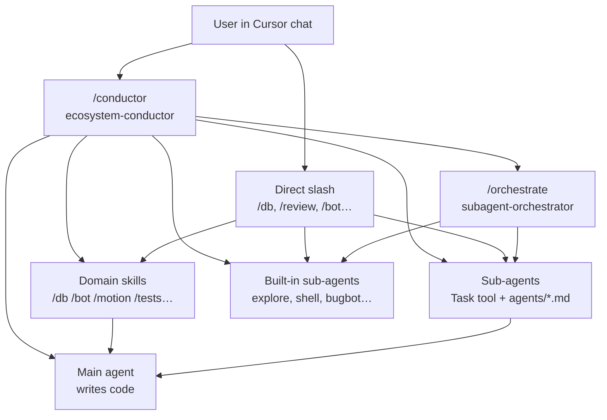

# Cursor Ecosystem


A personal Cursor ecosystem: **skills**, **slash commands**, and **custom sub-agents** for the AI agent in the IDE. The central router is `ecosystem-conductor` (`/conductor`): it selects a preset, builds the pipeline, and delegates to skills and sub-agents.

## Overview

| Layer | Purpose | Location |
|-------|---------|----------|
| **Skills** | Detailed workflows for specific domains (bots, databases, animations, tests, etc.) | `skills/` |
| **Commands** | Slash commands (`/conductor`, `/db`, `/review`, etc.) — entry points into skills and sub-agents | `commands/` |
| **Agents** | Prompts for specialized sub-agents (review, refactoring, CTF, etc.) | `agents/` |

## Architecture



**Core idea:** a single auto-router — `ecosystem-conductor` (`/conductor`). It determines what to run and in what order. Other skills do not self-activate — only via slash or conductor delegation.

## Repository Structure

```
cursor-ecosystem/
├── README.md
├── README.en.md
│
├── skills/                   # personal skills (8)
│   ├── ecosystem-conductor/  # main router
│   ├── subagent-orchestrator/
│   ├── fsd-project-explorer/
│   ├── motion-system-builder/
│   ├── test-writer/
│   ├── database-engineer/
│   ├── telegram-bot-builder/
│   └── project-idea-generator/
│
├── commands/                 # slash commands (21)
│   ├── conductor.md
│   ├── skills.md             # skills reference
│   ├── agents.md             # sub-agents reference
│   └── …
│
└── agents/                   # custom sub-agents (8)
    ├── code-reviewer.md
    ├── security-reviewer.md
    └── …
```

| Repository folder | Install path (Windows) | Install path (macOS / Linux) |
|-------------------|------------------------|------------------------------|
| `skills/` | `$env:USERPROFILE\.cursor\skills\` | `~/.cursor/skills/` |
| `commands/` | `$env:USERPROFILE\.cursor\commands\` | `~/.cursor/commands/` |
| `agents/` | `$env:USERPROFILE\.cursor\agents\` | `~/.cursor/agents/` |

## Installation

### Prerequisites

- Cursor IDE (version with Agent Skills support)

### Quick Start

PowerShell (Windows):

```powershell
git clone https://github.com/brabus13372-lab/cursor-ecosystem.git
$src = ".\cursor-ecosystem"
$dst = "$env:USERPROFILE\.cursor"
Copy-Item -Recurse -Force "$src\skills"   "$dst\skills"
Copy-Item -Recurse -Force "$src\commands" "$dst\commands"
Copy-Item -Recurse -Force "$src\agents"   "$dst\agents"
```

Bash (macOS / Linux):

```bash
git clone https://github.com/brabus13372-lab/cursor-ecosystem.git
cp -r cursor-ecosystem/skills   ~/.cursor/skills
cp -r cursor-ecosystem/commands ~/.cursor/commands
cp -r cursor-ecosystem/agents   ~/.cursor/agents
```

After installation, restart Cursor or open a new Agent chat.

### Backup

Sync changes from the local installation back to the repository.

PowerShell (Windows):

```powershell
$src = "$env:USERPROFILE\.cursor"
$dst = "<path-to-repo>"
Copy-Item -Recurse -Force "$src\skills"   "$dst\skills"
Copy-Item -Recurse -Force "$src\commands" "$dst\commands"
Copy-Item -Recurse -Force "$src\agents"   "$dst\agents"
```

Bash (macOS / Linux):

```bash
src="$HOME/.cursor"
dst="<path-to-repo>"
cp -r "$src/skills"   "$dst/skills"
cp -r "$src/commands" "$dst/commands"
cp -r "$src/agents"   "$dst/agents"
```

> **Note.** Built-in Cursor sub-agents (`explore`, `shell`, `bugbot`, `ci-investigator`, etc.) are not stored as files in this repository — they are embedded in the IDE. Only custom `agents/*.md` are versioned here.

## Pipeline Presets

`/conductor` is the main command for autonomous work. Specify a preset explicitly: `Preset: full`.

| Preset | When to use | Phases |
|--------|-------------|--------|
| **`full`** | Large feature, unfamiliar area, cross-cutting changes | Scout → Architect → Builder → Verifier → Critic → Security? → Handoff |
| **`fix`** | Known bug, familiar area | Builder → Verifier? → Critic (if sensitive) |
| **`discover`** | "How does it work?", "where is it?" — no code changes | Scout → ContextMap → stop |
| **`gate`** | Before PR/merge, code is ready | Verifier → Critic → Security? → DB-review? |
| **`parallel_discover`** | Parallel reconnaissance (backend + frontend + security) | `/orchestrate` Scouts → merge ContextMap → `full` or stop |
| **`ideate`** | Project idea brainstorm | `/ideas` → user selection → `full` |
| **`ctf`** | CTF web + bot + OOB | `/ctf-audit` → fix → `/terminal` → re-audit |

### Preset `full` graph

```
PipelinePlan
  → Scout (if low context) → ContextMap
  → Architect → TouchPointPlan
  → Builder → ChangeSet
  → Verifier → TestReport
  → Critic (/review) → ReviewFindings
  → Security? (/security) → ReviewFindings
  → Fixer (max 2 rounds) → re-Verifier → re-Critic
  → SessionHandoff
```

## Skills

| Skill | Command | Description |
|-------|---------|-------------|
| `ecosystem-conductor` | `/conductor` | Sole auto-router: triage, preset selection, pipeline construction, delegation to skills and sub-agents |
| `subagent-orchestrator` | `/orchestrate` | Sub-agent delegation rules: briefs, parallel fan-out, synthesis (phase skill, not a router) |
| `fsd-project-explorer` | `/fsd-map` | Read-only FSD/layered frontend map and placement guide for new code |
| `motion-system-builder` | `/motion` | Centralized Framer Motion system for React + TypeScript (light case, ≤2 files) |
| `test-writer` | `/tests` | Write and fix tests for the project stack (Vitest, Jest, RTL, Playwright, pytest) |
| `database-engineer` | `/db` | PostgreSQL implementation in Python: transactions, atomicity, locking, migrations |
| `telegram-bot-builder` | `/bot` | Telegram bots on aiogram 3.x: Router, handlers, FSM (light case, ≤2 files) |
| `project-idea-generator` | `/ideas` | Generate production-ready project ideas from constraints: stack, budget, timeline, audience |

## Commands

Each file `commands/<name>.md` maps to slash command `/name` in Cursor.

### Routing

| Command | Target | Purpose |
|---------|--------|---------|
| `/conductor` | `ecosystem-conductor` | Auto-router, pipeline presets, phase artifacts |
| `/orchestrate` | `subagent-orchestrator` | Sub-agent delegation (pipeline phase, not a router) |
| `/skills` | — | Skills and workflows reference |
| `/agents` | — | Sub-agents and chains reference |

### Exploration

| Command | Target | Purpose |
|---------|--------|---------|
| `/explore` | `explore` (built-in) | Fast read-only repository scan |
| `/research` | `codebase-research` | How/where/patterns investigation with file paths |
| `/fsd-map` | `fsd-project-explorer` | FSD map and placement guide |

### Implementation

| Command | Target | Purpose |
|---------|--------|---------|
| `/motion` | `motion-system-builder` | Light animations (≤2 files, single component) |
| `/motion-agent` | `motion-designer` | Heavy animations (≥3 files, new motion module) |
| `/tests` | `test-writer` | Tests for the project stack |
| `/db` | `database-engineer` | Postgres + Python implementation |
| `/db-review` | `database-reviewer` | SQL/atomicity audit (review only, not implement) |
| `/bot` | `telegram-bot-builder` | Light bot work (≤2 files) |
| `/bot-agent` | `bot-designer` | Heavy bot work (≥3 files, FSM, scheduler) |
| `/ideas` | `project-idea-generator` | Project idea generation |

### Review

| Command | Target | Purpose |
|---------|--------|---------|
| `/review` | `code-reviewer` | Code review of local `git diff` |
| `/security` | `security-reviewer` | Security audit of local changes |
| `/refactor` | `refactoring` | Refactoring without behavior change |

### Infrastructure

| Command | Target | Purpose |
|---------|--------|---------|
| `/ci` | `ci-investigator` | Root cause of a single failed CI check |
| `/terminal` | `shell` | Builds, tests, noisy CLI |
| `/ctf-audit` | `ctf-web-infra-auditor` | Read-only CTF web audit: chall + bot + OOB |

## Agents

Files in `agents/` are prompts for the Task tool. Cursor injects them when calling a matching `subagent_type`.

| Agent | Command | Scope |
|-------|---------|-------|
| `code-reviewer` | `/review` | Local change review: correctness, architecture, duplication, complexity, missing tests |
| `security-reviewer` | `/security` | Security audit: auth, secrets, injection, permissions, data exposure |
| `codebase-research` | `/research` | Read-only investigation with evidence (file paths); output compatible with ContextMap |
| `refactoring` | `/refactor` | Simplification, deduplication, complexity reduction without behavior change |
| `database-reviewer` | `/db-review` | Postgres + Python audit: atomicity, races, locking, SQL safety, migrations |
| `motion-designer` | `/motion-agent` | Framer Motion + React: full motion module, ≥3 files |
| `bot-designer` | `/bot-agent` | aiogram 3: handlers, routers, FSM, keyboards, scheduler |
| `ctf-web-infra-auditor` | `/ctf-audit` | Read-only CTF web infrastructure audit: remote chall API, DNS TXT/OOB, admin bot |

## Skill vs Sub-agent

**Rule:** a skill handles light work in the main thread via a clear workflow; a sub-agent handles isolated heavy or noisy tasks.

| Domain | Skill (light) | Sub-agent (heavy) |
|--------|-----------------|-------------------|
| **Animations** | `/motion` — ≤2 files, single component | `/motion-agent` — ≥3 files, new module |
| **Telegram bot** | `/bot` — ≤2 files, single handler | `/bot-agent` — ≥3 files, FSM, scheduler |
| **Database** | `/db` — implement writes/migrations | `/db-review` — audit diff only |
| **Research** | `/fsd-map` — FSD map | `/research` — deep how/where |
| **Review** | — | `/review`, `/security` (local) |

## Usage Examples

### Full pipeline (new feature)

```
/conductor Preset: full
Goal: [what to build]
Constraints: [what not to touch]
Done when: [criteria]
```

Internal flow: `/research` → TouchPointPlan → implement → `/tests` → `/review` → `/security`?

### Quick fix

```
/conductor Preset: fix
```

Or describe the bug directly — conductor selects preset `fix`: patch → tests (if needed) → review (if the area is sensitive).

### Pre-merge gate

```
/conductor Preset: gate
```

Runs Verifier → Critic → Security? → DB-review? for code ready before merge.

### Full-stack: bot + database

```
/bot → implement handlers
/db  → transactions for writes
/tests → pytest
/db-review → audit atomicity
/review → code quality
```

Alternative: `/conductor` with a feature description — conductor builds the pipeline automatically.

## Phase Artifacts

Conductor normalizes sub-agent output into structured blocks:

| Artifact | Description |
|----------|-------------|
| `PipelinePlan` | Goal, constraints, done criteria, phases, risk |
| `ContextMap` | Answer, files, patterns, open questions, entry point (~25 lines) |
| `TouchPointPlan` | What to create/change/leave alone, contracts, verification |
| `TestReport` | Pass/fail, commands, errors |
| `ReviewFindings` | Ship ready yes/no, critical/medium/low |
| `SessionHandoff` | What was done, decisions, files, verify command, prompt for the next chat |

## FAQ

### Cursor does not see commands and skills

1. Files must be in `~/.cursor/`, not only in the repository clone.
2. Restart Cursor or open a new Agent chat.
3. Slash commands: `commands/<name>.md` → `/name`.
4. Skills: folder `skills/<skill-name>/SKILL.md` with frontmatter `name` and `description`.

### What is the difference between a skill and a command?

- **Skill** (`SKILL.md`) — full workflow, activation criteria, instructions.
- **Command** (`commands/*.md`) — entry point: "read skill X and execute". Domain skills often have `disable-model-invocation: true` — they do not auto-activate, only via slash.

### Why is conductor the only auto-router?

To prevent skills from competing for control. `subagent-orchestrator` explicitly forbids self-start routing. Domain skills (`/bot`, `/db`, etc.) require slash or conductor delegation.

### Can skills be edited in the repository?

Yes. To apply changes in Cursor, copy them to `~/.cursor/` or work directly in the local installation and periodically sync with Git.

### Are Hugging Face skills required in the backup?

No for ecosystem portability. Plugin skills live in the plugin cache and update automatically.

### How many fix rounds after review?

Conductor runs **at most 2** rounds of Critic → Fixer → re-verify. After that, escalate to the user.

## Statistics

| Category | Count |
|----------|-------|
| Skills | 8 |
| Commands | 21 |
| Agents | 8 |
