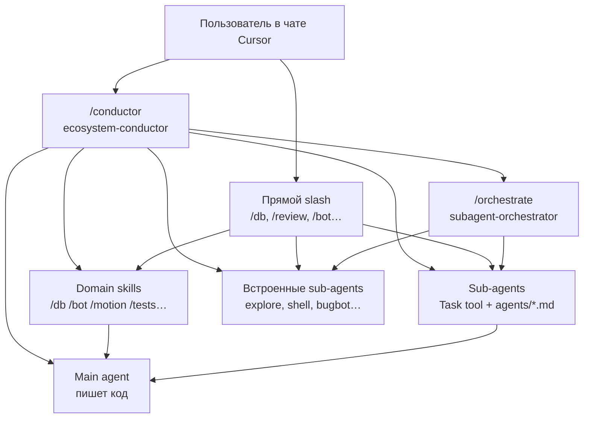

# Cursor Ecosystem


Персональная экосистема Cursor: **skills**, **slash-команды** и **кастомные sub-agents** для AI-агента в IDE. Центральный роутер — `ecosystem-conductor` (`/conductor`): он выбирает preset, строит pipeline и делегирует skills и sub-agents.

## Overview

| Layer | Purpose | Location |
|-------|---------|----------|
| **Skills** | Подробные workflow для конкретных доменов (боты, БД, анимации, тесты и др.) | `skills/` |
| **Commands** | Slash-команды (`/conductor`, `/db`, `/review` и др.) — точки входа в skills и sub-agents | `commands/` |
| **Agents** | Промпты для специализированных sub-agents (ревью, рефакторинг, CTF и др.) | `agents/` |

## Architecture



**Ключевая идея:** один auto-router — `ecosystem-conductor` (`/conductor`). Он определяет, что запускать и в каком порядке. Остальные skills не активируются автоматически — только по slash или по делегированию от conductor.

## Repository Structure

```
cursor-ecosystem/
├── README.md
├── README.en.md
│
├── skills/                   # персональные skills (8)
│   ├── ecosystem-conductor/  # главный роутер
│   ├── subagent-orchestrator/
│   ├── fsd-project-explorer/
│   ├── motion-system-builder/
│   ├── test-writer/
│   ├── database-engineer/
│   ├── telegram-bot-builder/
│   └── project-idea-generator/
│
├── commands/                 # slash-команды (21)
│   ├── conductor.md
│   ├── skills.md             # справочник skills
│   ├── agents.md             # справочник sub-agents
│   └── …
│
└── agents/                   # кастомные sub-agents (8)
    ├── code-reviewer.md
    ├── security-reviewer.md
    └── …
```

| Папка в репозитории | Путь установки (Windows) | Путь установки (macOS / Linux) |
|---------------------|--------------------------|--------------------------------|
| `skills/` | `$env:USERPROFILE\.cursor\skills\` | `~/.cursor/skills/` |
| `commands/` | `$env:USERPROFILE\.cursor\commands\` | `~/.cursor/commands/` |
| `agents/` | `$env:USERPROFILE\.cursor\agents\` | `~/.cursor/agents/` |

## Installation

### Prerequisites

- Cursor IDE (версия с поддержкой Agent Skills)

### Quick Start

PowerShell (Windows):

```powershell
git clone https://github.com/brabus13372-lab/cursor-ecosystem.git
$src = ".\cursor-ecosystem"
$dst = "$env:USERPROFILE\.cursor"
Copy-Item -Recurse -Force "$src\skills"   "$dst\skills"
Copy-Item -Recurse -Force "$src\commands" "$dst\commands"
Copy-Item -Recurse -Force "$src\agents"   "$dst\agents"
```

Bash (macOS / Linux):

```bash
git clone https://github.com/brabus13372-lab/cursor-ecosystem.git
cp -r cursor-ecosystem/skills   ~/.cursor/skills
cp -r cursor-ecosystem/commands ~/.cursor/commands
cp -r cursor-ecosystem/agents   ~/.cursor/agents
```

После установки перезапустите Cursor или откройте новый Agent chat.

### Backup

Синхронизация изменений из локальной установки обратно в репозиторий.

PowerShell (Windows):

```powershell
$src = "$env:USERPROFILE\.cursor"
$dst = "<path-to-repo>"
Copy-Item -Recurse -Force "$src\skills"   "$dst\skills"
Copy-Item -Recurse -Force "$src\commands" "$dst\commands"
Copy-Item -Recurse -Force "$src\agents"   "$dst\agents"
```

Bash (macOS / Linux):

```bash
src="$HOME/.cursor"
dst="<path-to-repo>"
cp -r "$src/skills"   "$dst/skills"
cp -r "$src/commands" "$dst/commands"
cp -r "$src/agents"   "$dst/agents"
```

> **Примечание.** Встроенные sub-agents Cursor (`explore`, `shell`, `bugbot`, `ci-investigator` и др.) не хранятся в файлах репозитория — они встроены в IDE. В репозитории представлены только кастомные `agents/*.md`.

## Pipeline Presets

`/conductor` — главная команда для автономной работы. Preset можно указать явно: `Preset: full`.

| Preset | Когда использовать | Фазы |
|--------|-------------------|------|
| **`full`** | Большая фича, незнакомая область, cross-cutting изменения | Scout → Architect → Builder → Verifier → Critic → Security? → Handoff |
| **`fix`** | Известный баг, понятная область | Builder → Verifier? → Critic (если чувствительно) |
| **`discover`** | «Как работает?», «где лежит?» — без изменения кода | Scout → ContextMap → стоп |
| **`gate`** | Перед PR/merge, код уже готов | Verifier → Critic → Security? → DB-review? |
| **`parallel_discover`** | Параллельная разведка (backend + frontend + security) | `/orchestrate` Scouts → merge ContextMap → `full` или стоп |
| **`ideate`** | Брейншторм идей проекта | `/ideas` → выбор пользователя → `full` |
| **`ctf`** | CTF web + bot + OOB | `/ctf-audit` → fix → `/terminal` → re-audit |

### Граф preset `full`

```
PipelinePlan
  → Scout (если мало контекста) → ContextMap
  → Architect → TouchPointPlan
  → Builder → ChangeSet
  → Verifier → TestReport
  → Critic (/review) → ReviewFindings
  → Security? (/security) → ReviewFindings
  → Fixer (макс. 2 раунда) → re-Verifier → re-Critic
  → SessionHandoff
```

## Skills

| Skill | Command | Description |
|-------|---------|-------------|
| `ecosystem-conductor` | `/conductor` | Единственный auto-router: triage, выбор preset, построение pipeline, делегирование skills и sub-agents |
| `subagent-orchestrator` | `/orchestrate` | Правила делегирования sub-agents: briefs, parallel fan-out, synthesis (фаза, не роутер) |
| `fsd-project-explorer` | `/fsd-map` | Read-only карта FSD/layered frontend и placement guide для нового кода |
| `motion-system-builder` | `/motion` | Централизованная система Framer Motion для React + TypeScript (лёгкий случай, ≤2 файла) |
| `test-writer` | `/tests` | Написание и исправление тестов под стек проекта (Vitest, Jest, RTL, Playwright, pytest) |
| `database-engineer` | `/db` | Реализация PostgreSQL в Python: транзакции, atomicity, locking, миграции |
| `telegram-bot-builder` | `/bot` | Telegram-боты на aiogram 3.x: Router, handlers, FSM (лёгкий случай, ≤2 файла) |
| `project-idea-generator` | `/ideas` | Генерация production-ready идей проекта из constraints: стек, бюджет, timeline, аудитория |

## Commands

Каждый файл `commands/<name>.md` соответствует slash-команде `/name` в Cursor.

### Routing

| Command | Target | Purpose |
|---------|--------|---------|
| `/conductor` | `ecosystem-conductor` | Auto-router, pipeline presets, артефакты между фазами |
| `/orchestrate` | `subagent-orchestrator` | Делегирование sub-agents (фаза pipeline, не роутер) |
| `/skills` | — | Справочник skills и workflows |
| `/agents` | — | Справочник sub-agents и цепочек |

### Exploration

| Command | Target | Purpose |
|---------|--------|---------|
| `/explore` | `explore` (встроенный) | Быстрый read-only скан репозитория |
| `/research` | `codebase-research` | Исследование «как/где/паттерны» с путями к файлам |
| `/fsd-map` | `fsd-project-explorer` | FSD-карта и placement guide |

### Implementation

| Command | Target | Purpose |
|---------|--------|---------|
| `/motion` | `motion-system-builder` | Лёгкие анимации (≤2 файла, один компонент) |
| `/motion-agent` | `motion-designer` | Тяжёлые анимации (≥3 файла, новый motion-модуль) |
| `/tests` | `test-writer` | Тесты под стек проекта |
| `/db` | `database-engineer` | Реализация Postgres + Python |
| `/db-review` | `database-reviewer` | Аудит SQL/atomicity (только review, не implement) |
| `/bot` | `telegram-bot-builder` | Лёгкая работа с ботом (≤2 файла) |
| `/bot-agent` | `bot-designer` | Тяжёлая работа с ботом (≥3 файла, FSM, scheduler) |
| `/ideas` | `project-idea-generator` | Генерация идей проектов |

### Review

| Command | Target | Purpose |
|---------|--------|---------|
| `/review` | `code-reviewer` | Code review локального `git diff` |
| `/security` | `security-reviewer` | Security audit локальных изменений |
| `/refactor` | `refactoring` | Рефакторинг без изменения поведения |

### Infrastructure

| Command | Target | Purpose |
|---------|--------|---------|
| `/ci` | `ci-investigator` | Root cause одной упавшей CI-проверки |
| `/terminal` | `shell` | Сборки, тесты, шумный CLI |
| `/ctf-audit` | `ctf-web-infra-auditor` | Read-only аудит CTF web: chall + bot + OOB |

## Agents

Файлы в `agents/` — промпты для Task tool. Cursor подставляет их при вызове matching `subagent_type`.

| Agent | Command | Scope |
|-------|---------|-------|
| `code-reviewer` | `/review` | Code review локальных изменений: correctness, architecture, duplication, complexity, missing tests |
| `security-reviewer` | `/security` | Security audit: auth, secrets, injection, permissions, data exposure |
| `codebase-research` | `/research` | Read-only исследование с evidence (пути к файлам); вывод совместим с ContextMap |
| `refactoring` | `/refactor` | Упрощение, дедупликация, снижение сложности без изменения поведения |
| `database-reviewer` | `/db-review` | Аудит Postgres + Python: atomicity, races, locking, SQL safety, migrations |
| `motion-designer` | `/motion-agent` | Framer Motion + React: полноценный motion-модуль, ≥3 файлов |
| `bot-designer` | `/bot-agent` | aiogram 3: handlers, routers, FSM, keyboards, scheduler |
| `ctf-web-infra-auditor` | `/ctf-audit` | Read-only аудит CTF web-инфраструктуры: remote chall API, DNS TXT/OOB, admin bot |

## Skill vs Sub-agent

**Правило:** skill — лёгкая работа в main thread по чёткому workflow; sub-agent — изолированная тяжёлая или шумная задача.

| Домен | Skill (лёгкий) | Sub-agent (тяжёлый) |
|-------|----------------|---------------------|
| **Анимации** | `/motion` — ≤2 файла, один компонент | `/motion-agent` — ≥3 файла, новый модуль |
| **Telegram bot** | `/bot` — ≤2 файла, один handler | `/bot-agent` — ≥3 файла, FSM, scheduler |
| **База данных** | `/db` — implement writes/migrations | `/db-review` — audit diff only |
| **Исследование** | `/fsd-map` — FSD map | `/research` — deep how/where |
| **Review** | — | `/review`, `/security` (локально) |

## Usage Examples

### Полный pipeline (новая фича)

```
/conductor Preset: full
Цель: [что строим]
Ограничения: [что не трогать]
Готово когда: [критерии]
```

Внутренний поток: `/research` → TouchPointPlan → implement → `/tests` → `/review` → `/security`?

### Быстрый фикс

```
/conductor Preset: fix
```

Или описать баг напрямую — conductor выберет preset `fix`: правка → тесты (при необходимости) → review (если область чувствительна).

### Pre-merge gate

```
/conductor Preset: gate
```

Запускает Verifier → Critic → Security? → DB-review? для готового кода перед merge.

### Full-stack: бот + база

```
/bot → implement handlers
/db  → transactions для writes
/tests → pytest
/db-review → audit atomicity
/review → code quality
```

Альтернатива: `/conductor` с описанием фичи — conductor построит pipeline автоматически.

## Phase Artifacts

Conductor нормализует вывод sub-agents в структурированные блоки:

| Artifact | Description |
|----------|-------------|
| `PipelinePlan` | Цель, constraints, done criteria, фазы, риск |
| `ContextMap` | Ответ, файлы, паттерны, open questions, entry point (~25 строк) |
| `TouchPointPlan` | Что создать/изменить/не трогать, контракты, верификация |
| `TestReport` | Pass/fail, команды, ошибки |
| `ReviewFindings` | Ship ready yes/no, critical/medium/low |
| `SessionHandoff` | Что сделано, решения, файлы, команда verify, промпт для следующего чата |

## FAQ

### Cursor не видит команды и skills

1. Файлы должны находиться в `~/.cursor/`, а не только в клоне репозитория.
2. Перезапустите Cursor или откройте новый Agent chat.
3. Slash-команды: `commands/<name>.md` → `/name`.
4. Skills: папка `skills/<skill-name>/SKILL.md` с frontmatter `name` и `description`.

### В чём разница skill и command?

- **Skill** (`SKILL.md`) — полный workflow, критерии активации, инструкции.
- **Command** (`commands/*.md`) — точка входа: «прочитай skill X и выполни». Domain skills часто имеют `disable-model-invocation: true` — они не auto-активируются, только по slash.

### Почему conductor — единственный auto-router?

Чтобы исключить гонку между skills за control. `subagent-orchestrator` явно запрещает self-start routing. Domain skills (`/bot`, `/db` и др.) требуют slash или делегирования от conductor.

### Можно ли редактировать skills в репозитории?

Да. Для применения в Cursor скопируйте изменения в `~/.cursor/` или работайте напрямую в локальной установке и периодически синхронизируйте с Git.

### Нужен ли Hugging Face skills в бэкапе?

Нет для переноса экосистемы. Plugin skills хранятся в кэше плагина и обновляются автоматически.

### Сколько раундов fix после review?

Conductor выполняет **максимум 2** раунда Critic → Fixer → re-verify. После этого — эскалация пользователю.

## Statistics

| Category | Count |
|----------|-------|
| Skills | 8 |
| Commands | 21 |
| Agents | 8 |
