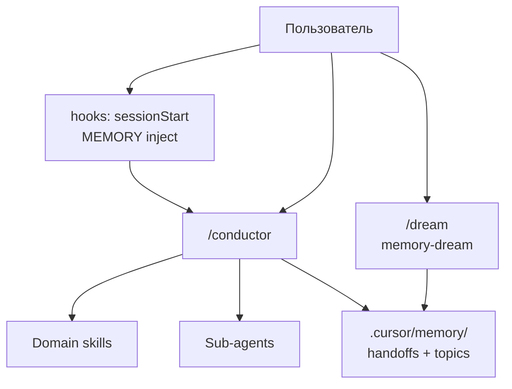

# Cursor Ecosystem


Персональная экосистема Cursor: **skills**, **slash-команды**, **sub-agents**, **hooks** и **память между сессиями**. Центральный роутер — `ecosystem-conductor` (`/conductor`).

Часть идей перенесена из архитектуры Claude Code (autoDream, coordinator mode, skill chains) — адаптировано под Cursor skills + hooks, без копирования проприетарного runtime.

**English:** [README.en.md](README.en.md)

---

## Что внутри

| Слой | Назначение | Папка в репо | Установка |
|------|------------|--------------|-----------|
| **Skills** | Workflow по доменам + conductor | `skills/` | `~/.cursor/skills/` |
| **Commands** | Slash-точки входа (`/conductor`, `/dream`…) | `commands/` | `~/.cursor/commands/` |
| **Agents** | Промпты sub-agents для Task tool | `agents/` | `~/.cursor/agents/` |
| **Hooks** | Авто-память на старт сессии, hint на stop | `hooks/`, `hooks.json` | `~/.cursor/` |
| **Memory** | Глобальный шаблон экосистемы | `memory/` | `~/.cursor/memory/` |

**Проектная память** (отдельно от репо): в каждом репозитории `.cursor/memory/` — создаётся conductor или `/dream`.

---

## Архитектура



**Правило:** единственный auto-router — `ecosystem-conductor`. Остальные skills — только по slash или делегированию conductor.

---

## Структура репозитория

```
cursor-ecosystem/
├── README.md / README.en.md
├── install.ps1 / install.sh
├── hooks.json
├── hooks/
│   ├── session-start-memory.mjs   # inject MEMORY + handoff
│   └── stop-handoff-hint.mjs      # напоминание про handoff (1×/сессию)
├── memory/                        # глобальный шаблон (~/.cursor/memory/)
├── skills/                          # 10 skills
│   ├── ecosystem-conductor/       # роутер + coordinator/improve presets, skill-chains…
│   ├── memory-dream/              # консолидация памяти (autoDream-like)
│   └── …
├── commands/                        # 23 slash-команды
└── agents/                        # 8 agents + AGENTS.md hub
```

---

## Установка

### Требования

- Cursor IDE с Agent Skills и Hooks
- Node.js 18+ (для hook-скриптов)

### Быстрый старт

**Windows (PowerShell):**

```powershell
git clone https://github.com/brabus13372-lab/cursor-ecosystem.git
cd cursor-ecosystem
.\install.ps1
```

**macOS / Linux:**

```bash
git clone https://github.com/brabus13372-lab/cursor-ecosystem.git
cd cursor-ecosystem
chmod +x install.sh && ./install.sh
```

Перезапусти Cursor или открой новый Agent chat. Проверь вкладку **Hooks** в настройках.

### Ручная установка

```powershell
$dst = "$env:USERPROFILE\.cursor"
Copy-Item -Recurse -Force .\skills\*   "$dst\skills\"
Copy-Item -Recurse -Force .\commands\* "$dst\commands\"
Copy-Item -Recurse -Force .\agents\*   "$dst\agents\"
Copy-Item -Recurse -Force .\hooks\*    "$dst\hooks\"
Copy-Item -Force .\hooks.json          "$dst\hooks.json"
Copy-Item -Recurse -Force .\memory\*   "$dst\memory\"
```

### Синхронизация обратно в репо

После правок в `~/.cursor/`:

```powershell
$src = "$env:USERPROFILE\.cursor"
$dst = "<path-to-this-repo>"
Copy-Item -Recurse -Force "$src\skills\*"   "$dst\skills\"
Copy-Item -Recurse -Force "$src\commands\*" "$dst\commands\"
Copy-Item -Recurse -Force "$src\agents\*"   "$dst\agents\"
Copy-Item -Recurse -Force "$src\hooks\*"    "$dst\hooks\"
Copy-Item -Force "$src\hooks.json"          "$dst\hooks.json"
Copy-Item -Recurse -Force "$src\memory\*"   "$dst\memory\"
```

---

## Pipeline presets (`/conductor`)

| Preset | Когда | Суть |
|--------|-------|------|
| **`full`** | Большая фича, незнакомая область | Orient → Scout → Architect → Builder → Verifier → Critic → Handoff → `/dream`? |
| **`coordinator`** | Multi-domain, много файлов | Main **не пишет** feature code — только роутит subagents |
| **`fix`** | Известный баг | Builder → Verifier? → Critic? |
| **`discover`** | Только исследование | Scout → ContextMap |
| **`gate`** | Перед merge | Tests + review + security |
| **`parallel_discover`** | Параллельные scouts | `/orchestrate` → merge → `full` |
| **`ideate`** | Идеи **нового** проекта | `/ideas` → выбор → `full` |
| **`improve`** | Улучшения **этого** репо | Orient → Scout → ImprovementPlan → выбор → `full` |
| **`ctf`** | CTF web + bot + OOB | `/ctf-audit` pipeline |
| **`dream`** | Память | `/dream` → DreamReport |

### Preset `coordinator`

Вдохновлён Claude Code `COORDINATOR_MODE`:

```
Orient → parallel scouts → TouchPointPlan → delegate Builders → gate → Handoff
```

- **Coordinator (main):** briefs, synthesis, ecosystem-файлы — не feature code
- **Builders:** `bot-designer`, `motion-designer`, `refactoring`, domain skills
- Док: `skills/ecosystem-conductor/coordinator-preset.md`

### Preset `improve`

```
Orient → Scout (ContextMap + Health signals) → Advisor → ImprovementPlan → stop
```

- **Advisor (main):** evidence-based рекомендации — без правок кода
- **Scout:** `/research`, `/explore`, `/fsd-map` или parallel via `/orchestrate`
- Slash: `/improve` или `Preset: improve`
- Док: `skills/ecosystem-conductor/improve-preset.md`

### Preset `full` (кратко)

```
PipelinePlan → Orient (.cursor/memory/) → Scout? → ContextMap
  → TouchPointPlan → Builder → Verifier → Critic → Security?
  → SessionHandoff → handoffs/latest.md → offer /dream
```

---

## Память между сессиями (Memory layer)

Идея из Claude Code **autoDream** → skill **`memory-dream`** (`/dream`).

### Глобально (`~/.cursor/memory/`)

Инвентарь экосистемы, presets, hooks — ставится из репо.

### В проекте (`.cursor/memory/`)

```
.cursor/memory/
├── MEMORY.md              # индекс (~25 строк)
├── architecture.md        # topic files
├── decisions.md
├── handoffs/latest.md     # последний SessionHandoff
└── .dream-state.json
```

### Hooks

| Событие | Скрипт | Эффект |
|---------|--------|--------|
| `sessionStart` | `session-start-memory.mjs` | Подмешивает MEMORY + handoff в контекст |
| `stop` (loop_limit: 1) | `stop-handoff-hint.mjs` | Напоминание записать handoff |

### `/dream`

4 фазы: orient → gather signal → consolidate → prune index.  
Gate: `node skills/memory-dream/scripts/dream-gate.mjs` (по умолчанию ≥24ч).

---

## Skill chains (`after:`)

В frontmatter skills — цепочки после успешного выполнения (когда conductor роутил):

| Skill | `after:` |
|-------|----------|
| `database-engineer` | `test-writer` → `database-reviewer` |
| `telegram-bot-builder` | `test-writer` |
| `motion-system-builder` | `test-writer` |
| остальные | `[]` — next step у conductor |

Полная таблица: `skills/ecosystem-conductor/skill-chains.md`

---

## Agent roles

| Роль | Кто | Пишет код? |
|------|-----|------------|
| Scout | `codebase-research`, `explore` | Нет (`readonly`) |
| Advisor | main (`improve` preset) | Нет — `ImprovementPlan` |
| Critic | `code-reviewer`, `security-reviewer`, `database-reviewer` | Нет |
| Builder | `bot-designer`, `motion-designer`, `refactoring` | Да, в `scope` |
| Coordinator | main (`coordinator` preset) | Нет (feature code) |

Hub: `agents/AGENTS.md` · Матрица: `skills/ecosystem-conductor/agent-roles.md`

---

## Skills (10)

| Skill | Command | Описание |
|-------|---------|----------|
| `ecosystem-conductor` | `/conductor` | Auto-router, presets, артефакты |
| `memory-dream` | `/dream` | Консолидация памяти |
| `subagent-orchestrator` | `/orchestrate` | Parallel delegation (фаза) |
| `fsd-project-explorer` | `/fsd-map` | FSD map (read-only) |
| `motion-system-builder` | `/motion` | Framer Motion, лёгкий случай |
| `test-writer` | `/tests` | Тесты под стек проекта |
| `database-engineer` | `/db` | Postgres + Python implement |
| `telegram-bot-builder` | `/bot` | aiogram 3, лёгкий случай |
| `project-idea-generator` | `/ideas` | Идеи проектов |

## Commands (23)

Справочник: `commands/skills.md` · Sub-agents: `commands/agents.md`

Ключевые: `/conductor`, `/improve`, `/dream`, `/orchestrate`, `/research`, `/review`, `/security`, `/db`, `/bot`, `/motion`, `/tests`, `/ideas`, `/ctf-audit`

## Agents (8 + hub)

| Agent | Command | readonly |
|-------|---------|----------|
| `codebase-research` | `/research` | yes |
| `code-reviewer` | `/review` | yes |
| `security-reviewer` | `/security` | yes |
| `database-reviewer` | `/db-review` | yes |
| `ctf-web-infra-auditor` | `/ctf-audit` | yes |
| `refactoring` | `/refactor` | bounded write |
| `bot-designer` | `/bot-agent` | bot scope |
| `motion-designer` | `/motion-agent` | motion scope |

---

## Примеры

### Полный pipeline

```
/conductor Preset: full
Цель: добавить auth middleware
Ограничения: не трогать legacy API
Готово когда: тесты зелёные, review ok
```

### Coordinator (multi-domain)

```
/conductor Preset: coordinator
Цель: bot handler + DB migration + motion onboarding
Ограничения: main не пишет feature code
```

### Улучшения текущего репо

```
/improve
Scope: backend + tests
```

```
/conductor Preset: improve
что улучшить в архитектуре и CI
```

После **ImprovementPlan** — выбери пункт → `/conductor Preset: full`.

### Память

```
/dream
Фокус: architecture + decisions из последнего handoff
```

### Продолжить в новом чате

```
/conductor продолжи: [задача]
Context: см. .cursor/memory/handoffs/latest.md
```

---

## Phase artifacts

| Artifact | Кто | Назначение |
|----------|-----|------------|
| `PipelinePlan` | Conductor | Цель, constraints, фазы |
| `ContextMap` | Scout | Файлы, паттерны, Health signals (`improve`) |
| `ImprovementPlan` | Advisor | Quick wins / strategic / do-not-touch (`improve`) |
| `TouchPointPlan` | Architect | Что создать/изменить |
| `TestReport` | Verifier | pass/fail |
| `ReviewFindings` | Critic | ship ready? |
| `SessionHandoff` | Closer | → `handoffs/latest.md` |
| `DreamReport` | memory-dream | Что consolidated |

---

## FAQ

**Cursor не видит команды?**  
Файлы в `~/.cursor/`, не только в клоне. Перезапуск Cursor.

**Hooks не работают?**  
Нужен Node в PATH. Проверь Settings → Hooks. Пути в `hooks.json` относительно `~/.cursor/`.

**Чем skill от command?**  
Skill = полный workflow. Command = «прочитай skill X и выполни».

**Зачем `coordinator`?**  
Когда задача на несколько доменов — main оркестрирует, builders пишут в своих scope.

**Чем `improve` от `ideate`?**  
`improve` — что улучшить **в текущем репо** (Scout + evidence). `ideate` (`/ideas`) — идеи **нового** проекта с нуля.

**Откуда идеи?**  
Память/dream/coordinator — из изучения leaked Claude Code CLI (архив, не runtime). Bash permissions и BUDDY **не** переносились.

**Сколько fix-раундов после review?**  
Максимум **2**, потом эскалация пользователю.

---

## Statistics

| Category | Count |
|----------|-------|
| Skills | 10 |
| Commands | 23 |
| Agents | 8 (+ AGENTS.md) |
| Hooks | 2 |
| Conductor supplement docs | 5 |

---

## License

MIT — см. использование на свой страх и риск; не аффилировано с Anthropic или Cursor.
