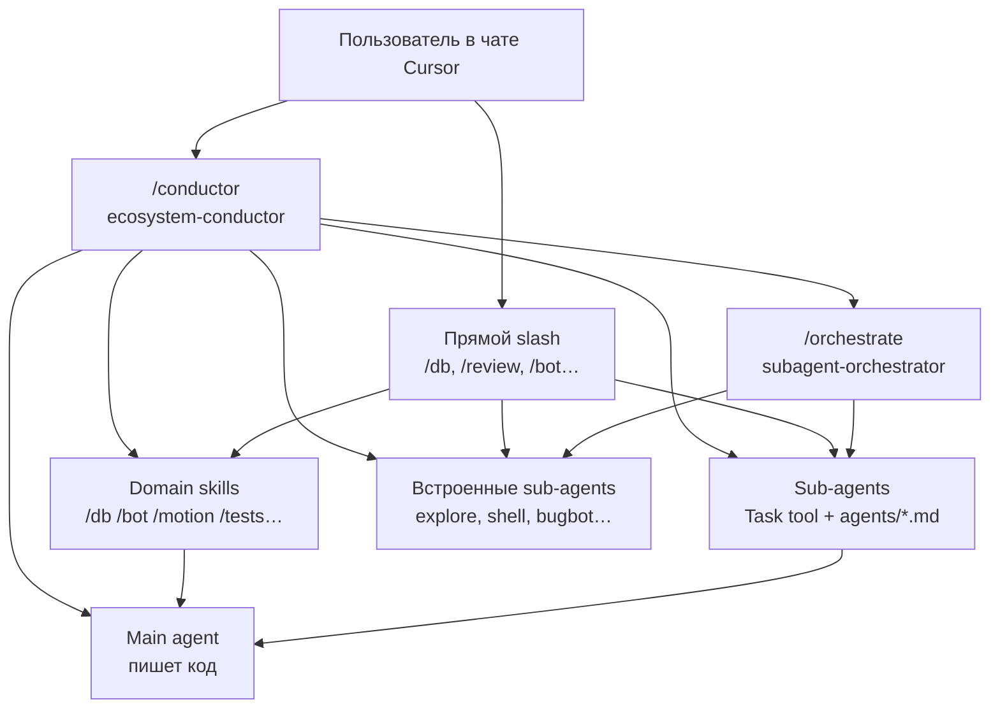

# Cursor Ecosystem — Skills, Commands & Sub-agents

Приватный бэкап персональной экосистемы Cursor: **skills**, **slash-команды** и **кастомные sub-agents**.  
Репозиторий — это зеркало того, что лежит в `~/.cursor/` на машине разработчика. Cursor читает конфиги оттуда, а не из этого репо напрямую.

---

## Содержание

1. [Что это и зачем](#что-это-и-зачем)
2. [Как устроена экосистема](#как-устроена-экосистема)
3. [Структура репозитория](#структура-репозитория)
4. [Установка и восстановление](#установка-и-восстановление)
5. [Иерархия: кто за что отвечает](#иерархия-кто-за-что-отвечает)
6. [Pipeline presets (`/conductor`)](#pipeline-presets-conductor)
7. [Персональные skills (`skills/`)](#персональные-skills-skills)
8. [Slash-команды (`commands/`)](#slash-команды-commands)
9. [Кастомные sub-agents (`agents/`)](#кастомные-sub-agents-agents)
10. [Встроенные skills Cursor (`skills-cursor/`)](#встроенные-skills-cursor-skills-cursor)
11. [Skill vs Sub-agent: когда что выбирать](#skill-vs-sub-agent-когда-что-выбирать)
12. [Локальный review vs PR review](#локальный-review-vs-pr-review)
13. [Типовые сценарии и цепочки](#типовые-сценарии-и-цепочки)
14. [Примеры промптов](#примеры-промптов)
15. [FAQ](#faq)

---

## Что это и зачем

Это набор инструкций для AI-агента в Cursor — не код приложения, а **«мозги и маршрутизация»**:

| Слой | Что делает | Где лежит |
|------|------------|-----------|
| **Skills** | Подробные workflow для конкретных доменов (боты, БД, анимации, тесты…) | `skills/` |
| **Commands** | Slash-команды (`/conductor`, `/db`, `/review`…) — точки входа в skills и sub-agents | `commands/` |
| **Agents** | Промпты для специализированных sub-agents (ревью, рефакторинг, CTF…) | `agents/` |
| **skills-cursor** | Встроенные skills от Cursor (canvas, create-skill, babysit…) — синкаются с IDE | `skills-cursor/` |

**Зачем бэкапить в Git:**
- перенос на другой ПК;
- история изменений промптов;
- откат, если что-то сломал в `~/.cursor/`;
- шаринг внутри команды (приватный репо).

**Чего здесь нет:** Hugging Face plugin skills — они живут в кэше плагина и подтягиваются автоматически.

---

## Как устроена экосистема



**Ключевая идея:** один **auto-router** — `ecosystem-conductor` (`/conductor`). Он решает, *что* запускать и в каком порядке. Все остальные skills **не стартуют сами** — только по slash или по делегированию от conductor.

---

## Структура репозитория

```
cursor-ecosystem/
├── README.md                 ← этот файл
│
├── skills/                   ← твои персональные skills (8 штук)
│   ├── ecosystem-conductor/  ← главный роутер
│   ├── subagent-orchestrator/
│   ├── fsd-project-explorer/
│   ├── motion-system-builder/
│   ├── test-writer/
│   ├── database-engineer/
│   ├── telegram-bot-builder/
│   └── project-idea-generator/
│
├── commands/                 ← slash-команды (21 файл)
│   ├── conductor.md
│   ├── skills.md             ← хаб-справочник по skills
│   ├── agents.md             ← хаб-справочник по sub-agents
│   └── …
│
├── agents/                   ← кастомные sub-agents (8 файлов)
│   ├── code-reviewer.md
│   ├── security-reviewer.md
│   └── …
│
└── skills-cursor/            ← встроенные skills Cursor (~20 штук)
    ├── create-skill/
    ├── canvas/
    ├── babysit/
    └── …
```

### Куда это ставится в Cursor

| Папка в репо | Путь на диске (Windows) |
|--------------|-------------------------|
| `skills/` | `C:\Users\<user>\.cursor\skills\` |
| `commands/` | `C:\Users\<user>\.cursor\commands\` |
| `agents/` | `C:\Users\<user>\.cursor\agents\` |
| `skills-cursor/` | `C:\Users\<user>\.cursor\skills-cursor\` |

---

## Установка и восстановление

### Первичная установка (новый ПК)

```powershell
# Клонировать репо
git clone https://github.com/brabus13372-lab/cursor-ecosystem.git

# Скопировать в ~/.cursor/ (перезапишет одноимённые папки!)
$src = ".\cursor-ecosystem"
$dst = "$env:USERPROFILE\.cursor"

Copy-Item -Recurse -Force "$src\skills"        "$dst\skills"
Copy-Item -Recurse -Force "$src\commands"      "$dst\commands"
Copy-Item -Recurse -Force "$src\agents"        "$dst\agents"
Copy-Item -Recurse -Force "$src\skills-cursor" "$dst\skills-cursor"
```

После копирования **перезапусти Cursor** (или открой новый чат) — skills и команды подхватятся.

### Обновить бэкап из живой системы

```powershell
$src = "$env:USERPROFILE\.cursor"
$dest = "C:\Users\Metron\Desktop\Skill, agents, commands"  # или путь к клону

Copy-Item -Recurse -Force "$src\skills"        "$dest\skills"
Copy-Item -Recurse -Force "$src\commands"      "$dest\commands"
Copy-Item -Recurse -Force "$src\agents"        "$dest\agents"
Copy-Item -Recurse -Force "$src\skills-cursor" "$dest\skills-cursor"
```

### Важно

- `skills-cursor/` — **managed Cursor'ом**. При обновлении IDE содержимое может перезаписаться. Для бэкапа своих настроек критичны `skills/`, `commands/`, `agents/`.
- Встроенные sub-agents (`explore`, `shell`, `bugbot`, `ci-investigator`…) **не лежат в файлах** — они зашиты в Cursor. В репо только **кастомные** `agents/*.md`.

---

## Иерархия: кто за что отвечает

| Роль | Инструмент | Правило |
|------|------------|---------|
| **Router** | `ecosystem-conductor` / `/conductor` | Решает *что* запускать и в каком порядке |
| **Delegation how-to** | `subagent-orchestrator` / `/orchestrate` | Только фаза делегирования — **не** конкурирует с conductor |
| **Domain skills** | `/bot`, `/db`, `/motion`, `/tests`… | Запускаются по slash или по маршруту conductor |
| **Phase sub-agents** | `/review`, `/security`, `/research`… | Фазы pipeline — не до implement, если не review-only |
| **Main agent** | основной чат | Пишет код; scouts и critics — read-only |

### Роли в multi-agent pipeline

| Роль | Кто | Пишет код? | Артефакт на выходе |
|------|-----|------------|-------------------|
| Router | Conductor | Нет | `PipelinePlan` |
| Scout | `/explore`, `/research`, `/fsd-map` | Нет | `ContextMap` |
| Architect | Main agent | Нет | `TouchPointPlan` |
| Builder | Main agent | **Да** | `ChangeSet` (git diff) |
| Verifier | `/tests`, `/terminal` | Только тесты | `TestReport` |
| Critic | `/review`, `/security`, `/db-review` | Нет | `ReviewFindings` |
| Fixer | Main agent | Да | исправленный diff |
| Closer | Conductor | Нет | `SessionHandoff` |

---

## Pipeline presets (`/conductor`)

`/conductor` — главная команда для автономной работы. Можно указать preset явно: `Preset: full`.

| Preset | Когда использовать | Фазы |
|--------|-------------------|------|
| **`full`** | Большая фича, незнакомая область, cross-cutting | Scout → Architect → Builder → Verifier → Critic → Security? → Handoff |
| **`fix`** | Известный баг, понятная область | Builder → Verifier? → Critic (если чувствительно) |
| **`discover`** | «Как работает?», «где лежит?» — без кода | Scout → ContextMap → стоп |
| **`gate`** | Перед PR/merge, код уже готов | Verifier → Critic → Security? → DB-review? |
| **`parallel_discover`** | Параллельный разведка (backend + frontend + security) | `/orchestrate` Scouts → merge ContextMap → `full` или стоп |
| **`ideate`** | Брейншторм идей проекта | `/ideas` → пользователь выбирает → `full` |
| **`ctf`** | CTF web + bot + OOB | `/ctf-audit` → fix → `/terminal` → re-audit |

### Граф preset `full`

```
PipelinePlan
  → Scout (если мало контекста) → ContextMap
  → Architect → TouchPointPlan
  → Builder → ChangeSet
  → Verifier → TestReport
  → Critic (/review) → ReviewFindings
  → Security? (/security) → ReviewFindings
  → Fixer (макс. 2 раунда) → re-Verifier → re-Critic
  → SessionHandoff
```

### Артефакты между фазами

Conductor нормализует вывод sub-agents в структурированные блоки — **не сырые логи**:

- **PipelinePlan** — цель, constraints, done criteria, фазы, риск
- **ContextMap** — ответ, файлы, паттерны, open questions, entry point (~25 строк)
- **TouchPointPlan** — что создать/изменить/не трогать, контракты, верификация
- **TestReport** — pass/fail, команды, ошибки
- **ReviewFindings** — ship ready yes/no, critical/medium/low
- **SessionHandoff** — что сделано, решения, файлы, команда verify, промпт для следующего чата

---

## Персональные skills (`skills/`)

### `ecosystem-conductor` → `/conductor`

**Единственный auto-router.** Triage по осям: intent, complexity, context, risk. Выбирает preset, строит pipeline, делегирует skills и sub-agents, синтезирует артефакты.

**Триггеры:** «разберись сам», «сделай всё», «полный pipeline», «исследуй → сделай → тесты → review», нетривиальная задача без явного slash.

**Не активируется:** однострочный фикс в известном файле; пользователь явно назвал одну команду; короткий ответ без кода.

---

### `subagent-orchestrator` → `/orchestrate`

**Phase skill** — *как* делегировать sub-agents: briefs, parallel fan-out, synthesis. **Не роутер.**

**Триггеры:** conductor направил сюда; пользователь написал `/orchestrate`; «параллельно исследуй», «оркестрируй subagents».

Содержит правила хорошего brief (Objective, Scope, Deliverable, Constraints, Return criteria) и когда sequential vs parallel.

---

### `fsd-project-explorer` → `/fsd-map`

Read-only карта FSD/layered frontend: `app`, `pages`, `widgets`, `features`, `entities`, `shared`. Placement guide — куда класть новый код.

**Когда:** «где лежит X?», «какая структура?», FSD-навигация, **без** правок кода.

---

### `motion-system-builder` → `/motion`

Централизованная система Framer Motion для React + TypeScript: variants, transitions, micro-interactions.

**Когда (лёгкий случай):** ≤2 файла, один компонент, preset/variant на существующем UI.

**Не для:** ≥3 файлов, новый motion-модуль → используй `/motion-agent`.

---

### `test-writer` → `/tests`

Тесты под стек проекта: Vitest, Jest, RTL, Playwright, pytest.

**Когда:** написать/починить тесты, coverage, TDD, «добавь тесты».

---

### `database-engineer` → `/db`

**Реализация** PostgreSQL в Python: транзакции, atomicity, locking, миграции. SQLAlchemy, asyncpg, psycopg, Alembic, raw SQL.

**Когда:** писать/менять SQL, миграции, data access.

**Не для аудита** — для аудита `/db-review`.

---

### `telegram-bot-builder` → `/bot`

Telegram-боты на **aiogram 3.x**: Router, handlers, FSM, middleware, schedulers.

**Когда (лёгкий случай):** ≤2 файла, один handler/command/keyboard.

**Не для:** ≥3 файлов, FSM flows, scheduler → `/bot-agent`.

---

### `project-idea-generator` → `/ideas`

Генерация production-ready идей из constraints: стек, бюджет, timeline, аудитория.

**Когда:** «что можно сделать?», MVP brainstorm, side-project идеи. См. также `examples.md` в папке skill.

---

## Slash-команды (`commands/`)

Каждый `.md` в `commands/` — slash-команда в Cursor. Имя файла = имя команды (без `.md`).

### Роутинг и оркестрация

| Команда | Файл | Назначение |
|---------|------|------------|
| `/conductor` | `conductor.md` | Auto-router, pipeline presets, артефакты |
| `/orchestrate` | `orchestrate.md` | Делегирование sub-agents (фаза, не роутер) |
| `/skills` | `skills.md` | Справочник skills + workflows |
| `/agents` | `agents.md` | Справочник sub-agents + chains |

### Исследование (read-only)

| Команда | Sub-agent / Skill | Назначение |
|---------|-------------------|------------|
| `/explore` | `explore` (встроенный) | Быстрый read-only скан репо |
| `/research` | `codebase-research` | Как/где/паттерны с путями к файлам |
| `/fsd-map` | `fsd-project-explorer` | FSD-карта и placement guide |

### Реализация (domain)

| Команда | Skill / Agent | Назначение |
|---------|---------------|------------|
| `/motion` | `motion-system-builder` | Лёгкие анимации (≤2 файла) |
| `/motion-agent` | `motion-designer` | Тяжёлые анимации (≥3 файла) |
| `/tests` | `test-writer` | Тесты под стек проекта |
| `/db` | `database-engineer` | Реализация Postgres + Python |
| `/db-review` | `database-reviewer` | Аудит SQL/atomicity (не implement) |
| `/bot` | `telegram-bot-builder` | Лёгкая работа с ботом (≤2 файла) |
| `/bot-agent` | `bot-designer` | Тяжёлая работа с ботом (≥3 файла) |
| `/ideas` | `project-idea-generator` | Идеи проектов |

### Review и качество

| Команда | Sub-agent | Контекст |
|---------|-----------|----------|
| `/review` | `code-reviewer` | **Локальный** `git diff` |
| `/security` | `security-reviewer` | **Локальный** security audit |
| `/refactor` | `refactoring` | Упрощение без смены поведения |
| `/review-bugbot` | `bugbot` (встроенный) | **GitHub PR / branch** diff |
| `/review-security` | `security-review` (встроенный) | **PR** security diff |

### Инфраструктура и утилиты

| Команда | Sub-agent | Назначение |
|---------|-----------|------------|
| `/ci` | `ci-investigator` | Одна упавшая CI-проверка |
| `/terminal` | `shell` | Сборки, тесты, шумный CLI |
| `/ctf-audit` | `ctf-web-infra-auditor` | CTF web: chall + bot + OOB |

---

## Кастомные sub-agents (`agents/`)

Файлы в `agents/` — промпты для Task tool. Cursor подставляет их при вызове matching `subagent_type` + custom agent file.

### `code-reviewer.md` → `/review`

Code review **локальных** изменений (`git diff`). Correctness, architecture, duplication, complexity, missing tests.

**Не для PR** — для PR `/review-bugbot`.

**Вывод:** findings по severity (critical / medium / low) с file, issue, reason, fix.

---

### `security-reviewer.md` → `/security`

Security audit локальных изменений: auth, secrets, injection, permissions, data exposure.

**Не для PR** — для PR `/review-security`.

---

### `codebase-research.md` → `/research`

Read-only исследование с **evidence** (пути к файлам). «Как работает X?», «где паттерн Y?», architecture.

Возвращает ContextMap-совместимый вывод для conductor pipeline.

---

### `refactoring.md` → `/refactor`

Рефакторинг без изменения поведения: упрощение, дедупликация, снижение сложности.

Не переписывает файлы целиком без запроса.

---

### `database-reviewer.md` → `/db-review`

Аудит Postgres + Python: atomicity, races, locking, SQL safety, migrations. **Только review**, не implement.

Запускать после `/db` на нетривиальных diff.

---

### `motion-designer.md` → `/motion-agent`

Sub-agent для Framer Motion + React. Полноценный motion-модуль, ≥3 файлов, audit существующих анимаций.

Для одной кнопки с fadeIn — `/motion` skill.

---

### `bot-designer.md` → `/bot-agent`

Sub-agent для aiogram 3: handlers, routers, FSM, keyboards, scheduler. Тяжёлая bot-работа.

Для одного handler — `/bot` skill.

---

### `ctf-web-infra-auditor.md` → `/ctf-audit`

Read-only аудит CTF web-инфраструктуры: remote chall API, DNS TXT/OOB, local vs remote drift, admin bot.

**До** правок `solve.py`. Типичный кейс: «bot 200 but no flag», OOB не работает.

---

### Встроенные sub-agents (не в репо)

Эти типы есть в Cursor, но **без файлов** в `agents/`:

| `subagent_type` | Команда | Роль |
|-----------------|---------|------|
| `explore` | `/explore` | Быстрый read-only scan |
| `shell` | `/terminal` | Терминал, сборки, тесты |
| `ci-investigator` | `/ci` | Root cause CI failure |
| `bugbot` | `/review-bugbot` | PR diff review |
| `security-review` | `/review-security` | PR security review |
| `generalPurpose` | — | База для custom agents (`motion-designer`, `bot-designer`…) |

---

## Встроенные skills Cursor (`skills-cursor/`)

Синкаются Cursor'ом из IDE. Бэкап для справки; при обновлении Cursor могут измениться.

| Skill | Назначение |
|-------|------------|
| `automate` | Создание Cursor Automations |
| `babysit` | PR merge-ready: комменты, конфликты, CI loop |
| `canvas` | Live React canvas для аналитики, таблиц, аудитов |
| `create-hook` | Cursor hooks (`hooks.json`, скрипты на события) |
| `create-rule` | Cursor rules (`.cursor/rules/`, coding standards) |
| `create-skill` | Авторинг новых Agent Skills |
| `create-subagent` | Создание кастомных sub-agents |
| `loop` | Повтор промпта/skill по интервалу (`/loop 5m /foo`) |
| `migrate-to-skills` | Миграция rules и commands → skills format |
| `review` | Обёртка review (Bugbot / Security) |
| `review-bugbot` | PR review через Bugbot |
| `review-security` | PR security review |
| `sdk` | Cursor SDK (`@cursor/sdk`, `cursor-sdk`) |
| `shell` | Literal shell execution для `/shell` |
| `split-to-prs` | Разбить работу на мелкие PR |
| `statusline` | Кастомный status line в CLI |
| `update-cursor-settings` | Правка `settings.json` |
| `update-cli-config` | Правка `~/.cursor/cli-config.json` |

Папка `canvas/sdk/` содержит TypeScript `.d.ts` для canvas-компонентов.

---

## Skill vs Sub-agent: когда что выбирать

Общее правило: **skill** — лёгкая работа в main thread по чёткому workflow; **sub-agent** — изолированная тяжёлая/шумная задача.

| Домен | Skill (лёгкий) | Sub-agent (тяжёлый) |
|-------|----------------|---------------------|
| **Анимации** | `/motion` — ≤2 файла, один компонент | `/motion-agent` — ≥3 файла, новый модуль |
| **Telegram bot** | `/bot` — ≤2 файла, один handler | `/bot-agent` — ≥3 файла, FSM, scheduler |
| **База данных** | `/db` — implement writes/migrations | `/db-review` — audit diff only |
| **Исследование** | `/fsd-map` — FSD map | `/research` — deep how/where |
| **Review** | — | `/review`, `/security` (локально) |

**Когда sub-agent вместо skill в main thread:**
- много файлов / шумный вывод (логи, деревья);
- read-only exploration на весь репо;
- специализированный review;
- внешние системы (GitHub, MCP).

**Когда НЕ делегировать:**
- однострочный фикс в известном файле;
- delegation дольше ~2 минут прямой работы.

---

## Локальный review vs PR review

| Ситуация | Команды |
|----------|---------|
| Текущие изменения в workspace, pre-commit | `/review` + `/security` |
| SQL/DB слой изменён | + `/db-review` |
| GitHub PR, branch diff, ссылка на PR | `/review-bugbot` + `/review-security` |
| Conductor preset `gate` (локально) | `/tests` → `/review` → `/security` → `/db-review`? |
| Conductor preset `gate` (PR) | `/review-bugbot` → `/review-security` |

**Правило:** PR/GitHub → built-in stack. Локальный implement → custom agents в `agents/`.

---

## Типовые сценарии и цепочки

### Новая фича в незнакомой области

```
/conductor Preset: full
Цель: [что строим]
Ограничения: [что не трогать]
Готово когда: [критерии]
```

Внутри: `/research` → TouchPointPlan → implement → `/tests` → `/review` → `/security`?

---

### Быстрый баг в известном месте

```
/conductor Preset: fix
```

Или просто описать баг — conductor сам выберет `fix`: правка → тесты (если нужно) → review (если чувствительно).

---

### Только разведка

```
/conductor Preset: discover
Как работает авторизация в этом проекте?
```

Или напрямую: `/research`, `/explore`, `/fsd-map`.

---

### Перед merge / PR

**Локально:**
```
/conductor Preset: gate
```

**GitHub PR:**
```
/review-bugbot
/review-security   # если auth/api/data
```

---

### Full-stack: бот + база

```
/bot → implement handlers
/db  → transactions для writes
/tests → pytest
/db-review → audit atomicity
/review → code quality
```

Или одной командой: `/conductor` с описанием фичи.

---

### CTF web

```
/ctf-audit          # сначала инфра, read-only
# main agent чинит solve/DNS
/terminal           # solve.py --dry-run, controlled bot trigger
/ctf-audit          # re-audit если exfil всё ещё нет
```

---

### Параллельная разведка

```
/conductor Preset: parallel_discover
```

Conductor вызовет `/orchestrate` → parallel scouts (disjoint scopes) → merge ContextMap → `full` или пауза для OK пользователя.

---

### Идеи → реализация

```
/ideas
# пользователь выбирает идею
/conductor Preset: full
Цель: [выбранная идея]
```

---

### CI красный

```
/ci → root cause
# main agent фиксит
/terminal → воспроизвести CI команду локально
```

---

## Примеры промптов

### Полный pipeline

```
/conductor
Preset: full
Цель: добавить endpoint /api/users/{id}/avatar с upload в S3
Ограничения: не трогать auth middleware, только PostgreSQL
Готово когда: pytest green, /review без critical
```

### Лёгкая анимация

```
/motion
Добавь fade-in для модалки подтверждения в components/ConfirmModal.tsx
```

### Аудит SQL перед коммитом

```
/db-review
Проверь atomicity в последних изменениях — race conditions, locking
```

### Параллельное исследование

```
/orchestrate
Параллельно: (1) backend auth flow в api/, (2) frontend session в features/auth/, (3) security skim secrets/env
Верни ContextMap по каждому scope
```

### Продолжение в новом чате

После `full` pipeline conductor выдаёт **SessionHandoff**:

```
/conductor продолжи: доделать avatar resize на клиенте.
Context: S3 bucket из env AVATAR_BUCKET, backend готов в api/routes/avatar.py
```

---

## FAQ

### Cursor не видит мои команды / skills

1. Файлы должны лежать в `~/.cursor/`, не только в клоне репо.
2. Перезапусти Cursor или открой новый Agent chat.
3. Slash-команды: `commands/<name>.md` → `/name`.
4. Skills: папка `skills/<skill-name>/SKILL.md` с frontmatter `name` и `description`.

### В чём разница skill и command?

- **Skill** (`SKILL.md`) — полный workflow, критерии активации, инструкции.
- **Command** (`commands/*.md`) — точка входа: «прочитай skill X и выполни». Часто `disable-model-invocation: true` на domain skills — они не auto-активируются, только по slash.

### Почему conductor — единственный auto-router?

Чтобы не было гонки между skills за control. `subagent-orchestrator` явно запрещает self-start routing. Domain skills (`/bot`, `/db`…) требуют slash или делегирования.

### Можно ли редактировать skills прямо в репо?

Да, но чтобы Cursor подхватил — скопируй обратно в `~/.cursor/` или работай напрямую там и периодически синкай в Git.

### Что будет с `skills-cursor` при обновлении Cursor?

Cursor может перезаписать. Твои кастомные настройки — в `skills/`, `commands/`, `agents/`.

### Нужен ли Hugging Face skills в бэкапе?

Нет для переноса экосистемы. Они в plugin cache и обновляются с плагином.

### Сколько раундов fix после review?

Conductor: **максимум 2** раунда Critic → Fixer → re-verify. Потом эскалация пользователю.

---

## Статистика репозитория

| Категория | Кол-во |
|-----------|--------|
| Персональные skills | 8 |
| Slash-команды | 21 |
| Кастомные sub-agents | 8 |
| Встроенные skills-cursor | ~20 |
| **Всего файлов** | **72** |

---

## Ссылки

- **Репозиторий:** https://github.com/brabus13372-lab/cursor-ecosystem
- **Локальный путь Cursor:** `%USERPROFILE%\.cursor\`
- **Документация Cursor Skills:** https://docs.cursor.com (раздел Agent Skills)

---

*Последний бэкап: skills + commands + agents + skills-cursor (без Hugging Face plugin).*
